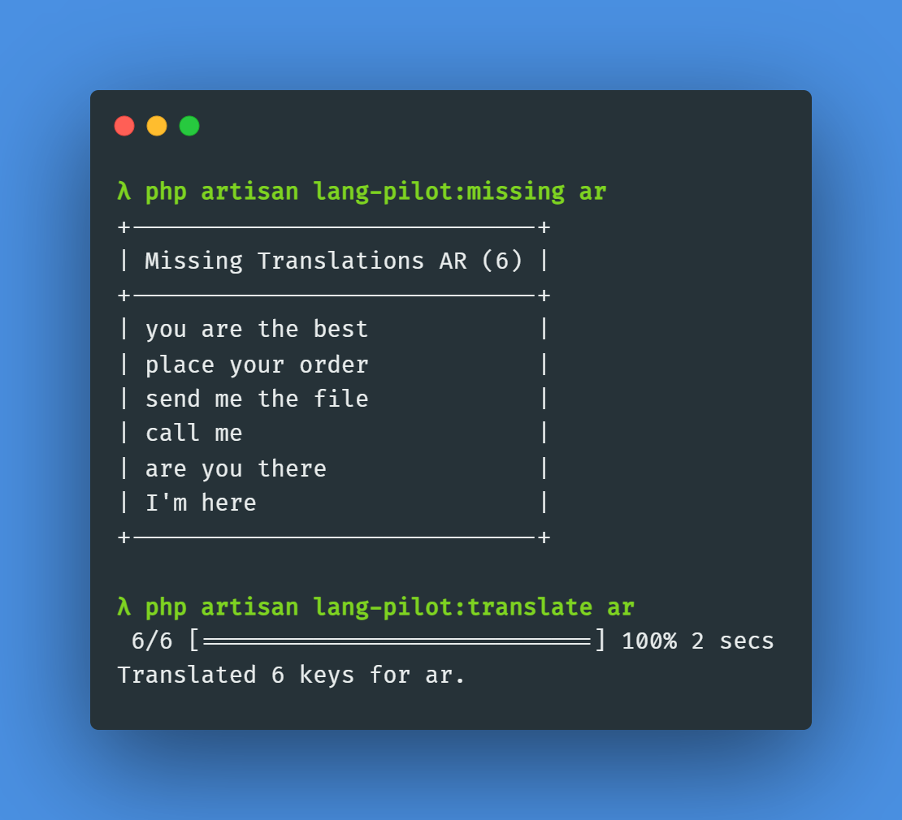

<p align="center">
    
</p>

------

**Lang Pilot** allows you to translate your app into any language depending on your description using AI.

## Installation

> **Requires [PHP 8.0+](https://php.net/releases/)**

Require LangPilot using [Composer](https://getcomposer.org):

```bash
composer require zsnakeee/lang-pilot
```

---

## Config

You can publish the config file with:

```bash
php artisan vendor:publish --tag=lang-pilot-config
```

---

## Usage

### Missing translations

Show missing translations for a specific locale:

```bash
php artisan lang-pilot:missing {locale}
```

```bash
php artisan lang-pilot:missing ar
```

---

### Translate missing translations

Translate missing translations for a specific locale:

```bash
php artisan lang-pilot:translate {locale}
```

```bash
php artisan lang-pilot:translate ar
```

---

### Testing

``` bash
composer test
```

---

### License

```
Lang Pilot is open-sourced software licensed under the [MIT license](LICENSE.md).
```

### Support

If you encounter any issues or have questions, feel free to open an issue
on [GitHub](https://github.com/zsnakeee/lang-pilot/issues).
